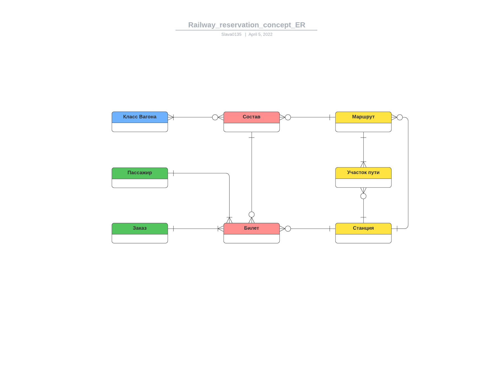
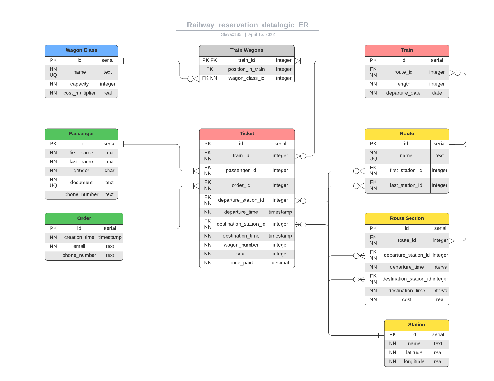
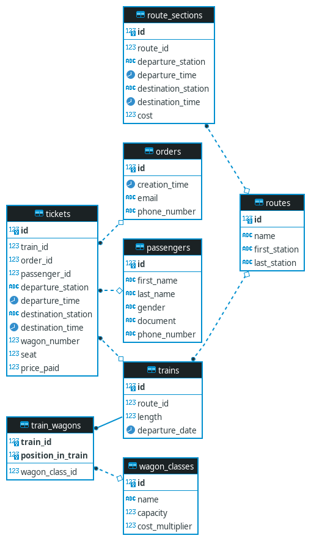
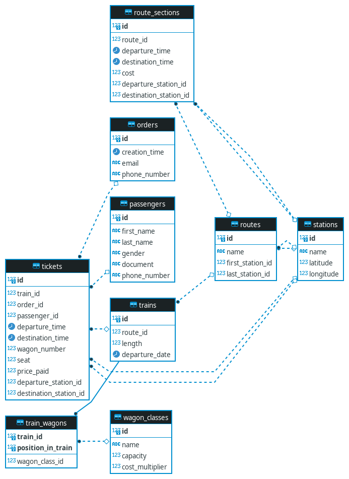

# Отчет по лабораторной работе №1

## Цель

Познакомиться с основами проектирования схемы БД, способами организации данных в SQL-БД, а также с языком описания сущностей и ограничений БД SQL-DDL.

## Программа работы

* Часть 1
  1. Создание проекта для работы в GitLab.
  2. Выбор задания (предметной области), описание набора данных и требований к хранимым данным в свободном формате в wiki своего проекта в GitLab.
  3. Формирование в свободном формате (предпочтительно в виде графической схемы) cхемы БД, соответствующей заданию. Должно получиться не менее 7 таблиц.
  4. Согласование с преподавателем схемы БД. Обоснование принятых решений и соответствия требованиям выбранного задания.
  5. Выкладывание схемы БД в свой проект в GitLab.
  6. Демонстрация результатов преподавателю.
* Часть 2
  1. Самостоятельное изучение SQL-DDL.
  2. Создание скрипта БД в соответствии с согласованной схемой. Должны присутствовать первичные и внешние ключи, ограничения на диапазоны значений. Демонстрация скрипта преподавателю.
  3. Создание скрипта, заполняющего все таблицы БД данными.
  4. Выполнение SQL-запросов, изменяющих схему созданной БД по заданию преподавателя. Демонстрация их работы преподавателю.

## Ход работы

### Часть 1

В качестве предметной области я выбрал Железнодорожную Систему Бронирования, где необходимо хранить следующие данные:

* Список составов (номер маршрута, день отправления, количество и типы вагонов).
* Классы вагонов - люкс/купе/плацкарт/сидячий (количество мест, множитель стоимости)
* Список маршрутов (номер, начальная станция, конечная станция).
* Список участков пути (номер маршрута, текущая станция и время отправления, следующая станция и время прибытия, стоимость на место за этот участок).
* Список заказов (дата оформления, билеты, контакты заказа - электронная почта и номер телефона).
  * Один человек может оформить билеты на нескольких пассажиров.
* Список билетов (номер состава/маршрута, данные пассажира, станция и время назначения/отправления, класс и номер вагона, посадочное место, номер заказа, стоимость билета).
* Данные пассажиров (ФИО, пол, номер документа, номер телефона).
  * На одного пассажира может быть оформлено несколько билетов (можно выкупить несколько мест для удобства).

**Индивидуальное задание из второй части - ввести в предметную область сущность "Станция", которая характеризуется названием и географическими координатами.**

Я создал следующую концептуальную схему:

На ее основе я построил даталогическую модель БД:

### Часть 2

Я написал [скрипт](lab1/create_tables.sql) для добавления таблиц в соответствии с построенной схемой.

В результате получилась следующая схема БД:

Далее я написал [скрипт](lab1/fill_tables.sql), заполняющий все таблицы БД данными.

По индивидуальному заданию я написал [скрипт](lab1/update_tables.sql), добавляющий в схему сущность Станция.

## Выводы

В ходе выполнения данной лабораторной работы я познакомился с основами проектирования схемы БД через построение собственной схемы для поставленной задачи. Кроме того я познакомился с языком описания сущностей и ограничений БД SQL-DDL.
