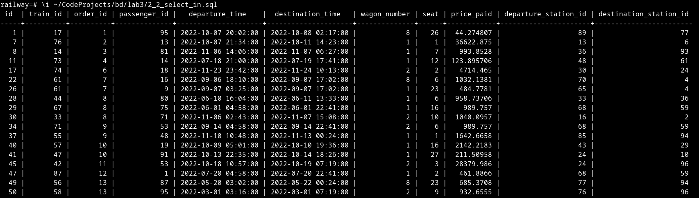
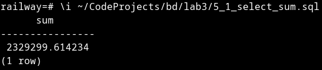

# Отчет по лабораторной работе №3

## Цель

Познакомиться с языком создания запросов управления данными SQL-DML.

## Программа работы

1. Изучение SQL-DML.
2. Выполнение всех запросов из списка стандартных запросов. Демонстрация результатов преподавателю.
3. Получение у преподавателя и реализация SQL-запросов в соответствии с индивидуальным заданием. Демонстрация результатов преподавателю.
4. Сохранение в БД выполненных запросов SELECT (только п. 3) в виде представлений, запросов INSERT, UPDATE или DELETE -- в виде ХП. Выкладывание скрипта в GitLab.

## Ход работы

### Часть 2

* Сделайте выборку всех данных из таблицы: [скрипт](lab3/1_select_all.sql)

```sql
-- Выбирает всех пассажиров
SELECT *
FROM passengers;
```


* Сделайте выборку данных из одной таблицы при нескольких условиях, с использованием логических операций, LIKE, BETWEEN, IN (не менее 3-х разных примеров): [скрипт 1](lab3/2_1_select_between.sql), [скрипт 2](lab3/2_2_select_in.sql), [скрипт 3](lab3/2_3_select_like.sql)

```sql
-- Выбирает все поезда с длиной от 1 до 7
SELECT *
FROM trains
WHERE length BETWEEN 1 AND 7;
```


```sql
-- Выбирает билеты с местами в 1, 2 и 8 вагонах
SELECT *
FROM tickets
WHERE wagon_number IN (1, 2, 8);
```



```sql
-- Выбирает станции с пробелом в названии
SELECT *
FROM stations
WHERE name LIKE '% %';
```


* Создайте в запросе вычисляемое поле: [скрипт](lab3/3_select_computed.sql)

```sql
-- Выводит список полных контактов заказа
SELECT concat(
        'Email: ',
        email,
        '    Phone Number: ',
        phone_number
    ) AS contacts
FROM orders;
```


* Сделайте выборку всех данных с сортировкой по нескольким полям: [скрипт](lab3/4_select_sort.sql)

```sql
-- Выбирает билеты в удобном порядке
SELECT *
FROM tickets
ORDER BY train_id,
    wagon_number,
    seat;
```

Удобно в том смысле, что все отсортировано в порядке "поезд-вагон-место"


* Создайте запрос, вычисляющий несколько совокупных характеристик таблиц: [скрипт 1](lab3/5_1_select_sum.sql), [скрипт 2](lab3/5_2_select_avg.sql)

```sql
-- Вычисляет полную стоимость всех билетов
SELECT sum(price_paid)
FROM tickets;
```



```sql
-- Вычисляет среднюю длину всех поездов
SELECT avg(length)
FROM trains;
```


* Сделайте выборку данных из связанных таблиц (не менее двух примеров): [скрипт 1](lab3/6_1_select_join.sql), [скрипт 2](lab3/6_2_select_join.sql)

```sql
-- Выводит станции прибытия для маршрута
SELECT routes.name AS route,
    stations.name AS destination
FROM routes
    INNER JOIN route_sections ON routes.id = route_sections.route_id
    INNER JOIN stations ON route_sections.destination_station_id = stations.id
ORDER BY (routes.name, route_sections.departure_time);
```


```sql
-- Выводит номер поезда и название маршрута
SELECT trains.id as train_id,
    routes.name as route_name
    FROM trains
    INNER JOIN routes ON trains.route_id = routes.id;
```


* Создайте запрос, рассчитывающий совокупную характеристику с использованием группировки, наложите ограничение на результат группировки: [скрипт](lab3/7_select_group.sql)

```sql
-- Выбирает поезда с совокупной стоимостью билетов больше заданной
SELECT sum(tickets.price_paid),
    tickets.train_id
FROM tickets
GROUP BY tickets.train_id
HAVING sum(tickets.price_paid) > 10000;
```


* Придумайте и реализуйте пример использования вложенного запроса: [скрипт](lab3/8_select_subquery.sql)

```sql
-- Выбирает маршруты, где первая станция находится в северном полушарии
SELECT *
FROM routes
WHERE routes.first_station_id IN (
        SELECT stations.id
        FROM stations
        WHERE latitude > 0
    )
```


* С помощью оператора UPDATE измените значения нескольких полей у всех записей, отвечающих заданному условию: [скрипт](lab3/9_update.sql)

```sql
-- Увеличивает стоимость всех участков второго маршрута на 1000
UPDATE route_sections
SET cost = cost + 1000
WHERE route_id = 2;
```


* С помощью оператора DELETE удалите запись, имеющую максимальное (минимальное) значение некоторой совокупной характеристики: [скрипт](lab3/10_delete_min.sql)

```sql
-- Удаляет билеты с наименьшей стоимостью
DELETE FROM tickets
WHERE price_paid = (
        SELECT min(price_paid)
        FROM tickets
    );
```


* С помощью оператора DELETE удалите записи в главной таблице, на которые не ссылается подчиненная таблица (используя вложенный запрос): [скрипт](lab3/11_delete_unused.sql)

```sql
-- Удаляет все неиспользуемые станции
DELETE FROM stations
WHERE id NOT IN (
        SELECT (departure_station_id)
        FROM route_sections
        UNION
        SELECT (destination_station_id)
        FROM route_sections
        UNION
        SELECT (departure_station_id)
        FROM tickets
        UNION
        SELECT (destination_station_id)
        FROM tickets
        UNION
        SELECT (first_station_id)
        FROM routes
        UNION
        SELECT (last_station_id)
        FROM routes
    );
```


### Часть 3

Индивидуальное задание:

1. Вывести количество пассажиров, перевезенных вагонами каждого класса, за последний месяц и общую сумму, вырученную с билетов, которые были куплены этими группами пассажиров: [скрипт](lab3/ind_1.sql)
2. Написать хранимую процедуру/функцию, которая вычисляет расстояние между двумя станциями (идентификаторы станций должны быть параметрами ХП): [скрипт](lab3/ind_2.sql)
3. Используя ХП из пункта выше для вычисления расстояний между станциями, вывести топ-5 самых длинных маршрутов: [скрипт](lab3/ind_3.sql)

```sql
-- Выводит количество пассажиров, перевезенных вагонами каждого класса, за последний месяц и общую сумму, вырученную с билетов, которые были куплены этими группами пассажиров.
SELECT r.wagon_class_id,
    count(r.id) as passengers,
    sum(r.price_paid) as total_price
FROM (
        (
            SELECT *
            FROM tickets
            WHERE (
                    departure_time > (CURRENT_DATE - INTERVAL '1 month')
                    AND departure_time < CURRENT_DATE
                )
        ) as last_month_tickets
        INNER JOIN train_wagons ON (
            last_month_tickets.train_id = train_wagons.train_id
            AND last_month_tickets.wagon_number = train_wagons.position_in_train
        )
    ) as r
GROUP BY r.wagon_class_id;
```


```sql
-- Написать хранимую процедуру/функцию, которая вычисляет расстояние между двумя станциями (идентификаторы станций должны быть параметрами ХП).
CREATE OR REPLACE FUNCTION station_distance(first_station_id int, second_station_id int) RETURNS float AS $dist$
DECLARE 
    lat1 float;
    lon1 float;
    lat2 float;
    lon2 float;

    dist float = 0;
    radlat1 float;
    radlat2 float;
    theta float;
    radtheta float;
BEGIN
    SELECT INTO lat1, lon1 latitude, longitude
    FROM stations 
    WHERE id = first_station_id;
    SELECT INTO lat2, lon2 latitude, longitude
    FROM stations 
    WHERE id = second_station_id;

    IF lat1 = lat2 AND lon1 = lon2
        THEN RETURN dist;
    ELSE
        radlat1 = pi() * lat1 / 180;
        radlat2 = pi() * lat2 / 180;
        theta = lon1 - lon2;
        radtheta = pi() * theta / 180;
        dist = sin(radlat1) * sin(radlat2) + cos(radlat1) * cos(radlat2) * cos(radtheta);

        IF dist > 1 THEN dist = 1; END IF;

        dist = acos(dist);
        dist = dist * 180 / pi();
        dist = dist * 60 * 1.1515;
        dist = dist * 1.609344;

        RETURN dist;
    END IF;
END;
$dist$ 
LANGUAGE plpgsql
IMMUTABLE;
-- Формулы я взял отсюда https://www.geodatasource.com/developers/postgresql
```

В начале вывел таблицу со станциями, сначала идет latitude, потом longitude

Расстояние измеряется в километрах


```sql
-- Используя ХП для вычисления расстояний между станциями, вывести топ-5 самых длинных маршрутов.
SELECT r.name as route_name,
    sum(dist) as total_distance
FROM (
        SELECT sections.name,
            sections.route_id,
            station_distance(
                sections.departure_station_id,
                sections.destination_station_id
            ) as dist
        FROM (
                routes
                INNER JOIN route_sections ON (
                    routes.id = route_sections.route_id
                )
            ) as sections
    ) as r
GROUP BY r.name
ORDER BY total_distance DESC
LIMIT 5;
```


### Часть 4

Я создал скрипты для сохранения результатов запросов 1 и 3 из индивидуального задания (во втором задании у нас ХП): [скрипт 1](lab3/view_1.sql) и [скрипт 3](lab3/view_3.sql)

```sql
-- Сохраняет в представление количество пассажиров, перевезенных вагонами каждого класса, за последний месяц и общую сумму, вырученную с билетов, которые были куплены этими группами пассажиров.
CREATE OR REPLACE VIEW "Last month stats" AS
SELECT r.wagon_class_id,
    count(r.id) as passengers,
    sum(r.price_paid) as total_price
FROM (
        (
            SELECT *
            FROM tickets
            WHERE (
                    departure_time > (CURRENT_DATE - INTERVAL '1 month')
                    AND departure_time < CURRENT_DATE
                )
        ) as last_month_tickets
        INNER JOIN train_wagons ON (
            last_month_tickets.train_id = train_wagons.train_id
            AND last_month_tickets.wagon_number = train_wagons.position_in_train
        )
    ) as r
GROUP BY r.wagon_class_id;
```


```sql
-- Используя ХП для вычисления расстояний между станциями, сохраняет в представление топ-5 самых длинных маршрутов.
CREATE OR REPLACE VIEW "5 longest routes" AS
SELECT r.name as route_name,
    sum(dist) as total_distance
FROM (
        SELECT sections.name,
            sections.route_id,
            station_distance(
                sections.departure_station_id,
                sections.destination_station_id
            ) as dist
        FROM (
                routes
                INNER JOIN route_sections ON (
                    routes.id = route_sections.route_id
                )
            ) as sections
    ) as r
GROUP BY r.name
ORDER BY total_distance DESC
LIMIT 5;
```


## Выводы

В ходе выполнения данной лабораторной работы я познакомился с языком создания запросов управления данными SQL-DML: научился формировать сложные запросы, писать хранимые процедуры для выполнения операций и сохранять результаты выполнения запросов в представления.
